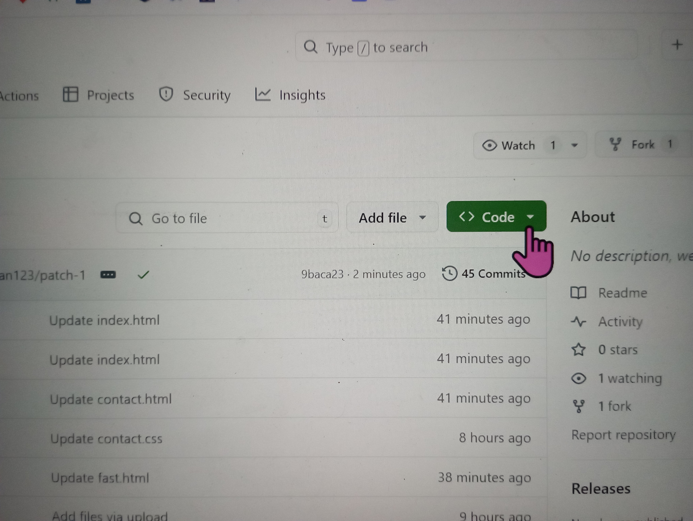
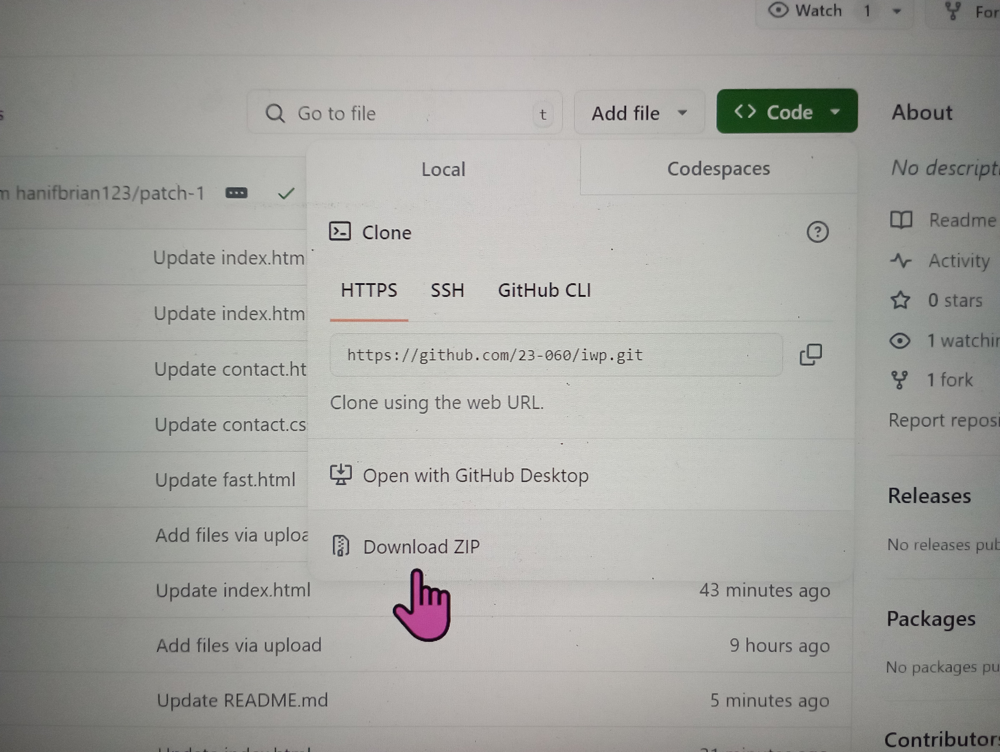
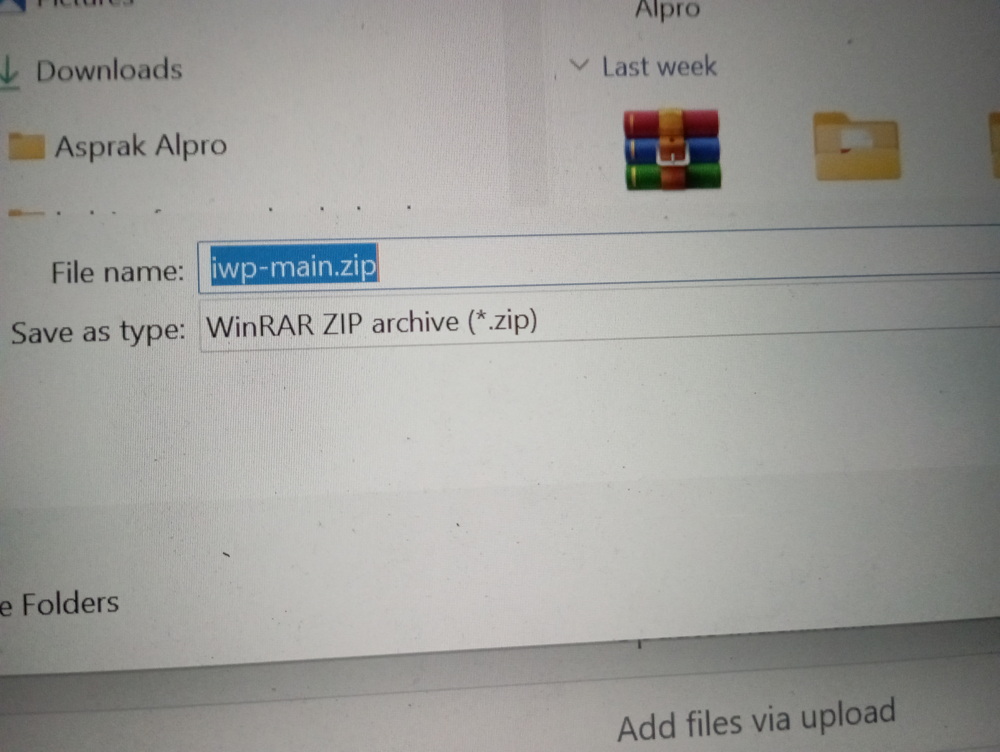
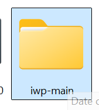
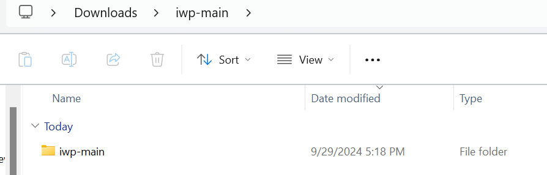
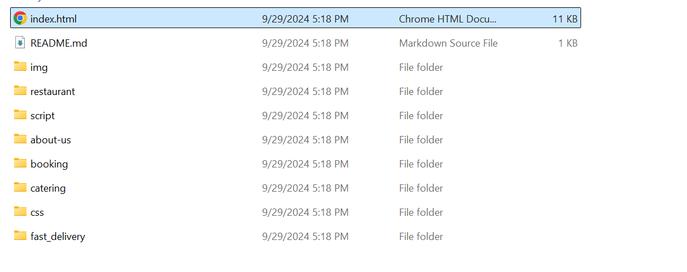

# IWP | Indo Waroeng Prasmanan 
# Panduan Menjalankan Website

## Cara Run Website

1. **Clone repository pada local anda dengan cara berikut:**
   - Klik tombol **Code** seperti yang ditunjukkan di bawah.
   
    
   
   - Klik **Download ZIP**.

   

   - Pilih lokasi penyimpanan yang diinginkan untuk file ZIP ini.

   

2. **Extract file ZIP:**
   - Setelah selesai mendownload, extract file ZIP tersebut.
   - Setelah selesai, buka folder hasil extract.

   

3. **Masuk ke folder proyek:**
   - Masuk lagi ke folder `iwp-main` seperti yang ditunjukkan pada gambar di bawah.

   

4. **Buka file `index.html`:**
   - Setelah masuk ke folder, buka file `index.html` menggunakan browser untuk mulai menjalankan website.

   

5. **Website berhasil dijalankan:**
   - Sekarang website sudah mulai berjalan.

   

> **Catatan:**
> Pastikan koneksi internet anda aktif untuk mengakses gambar yang di-host melalui URL internet.

---

## Cara Kerja Website

Terdapat tombol navigasi (ikon 3 baris) pada pojok kanan atas di semua halaman pada website ini yang berfungsi untuk navigasi website. Klik tombol tersebut untuk melihat hyperlink ke semua halaman web pada website ini.

---

### Halaman Beranda:

Ini adalah tampilan halaman beranda. Klik tombol `Buat Reservasi` di pojok kanan atas untuk mulai proses pemesanan meja di restoran **Indo Waroeng Prasmanan**. Setelah masuk, ikuti langkah-langkah proses pemesanan sampai selesai. 

Terdapat 3 card di tengah halaman: `Restaurant`, `Fast Delivery`, dan `Catering`:
- **Klik card `Restaurant`** untuk menuju ke halaman restaurant, di mana tersedia informasi lebih lengkap tentang **Indo Waroeng Prasmanan**. Anda juga bisa melakukan reservasi di sana.
- **Klik card `Fast Delivery`** untuk mulai pemesanan makanan/minuman secara online. Di sini juga terdapat fitur prasmanan yang memungkinkan anda untuk kustomisasi piring anda.
- **Klik card `Catering`** untuk menuju ke halaman **Catering**, di mana anda bisa melakukan pemesanan katering.

---

### Halaman `Restaurant`:

Saat halaman ini dibuka pertama kali, akan tersedia tombol **Reservasi Sekarang** untuk mulai pemesanan meja di restoran **Indo Waroeng Prasmanan**.

Scroll ke bawah untuk melihat keseluruhan halaman `Restaurant`.

---

### Halaman `Catering`:
Setelah masuk ke halaman **Catering** untuk pertama kali, terdapat tombol **Bicara pada Chef Kami** di bagian bawah tengah untuk melanjutkan pemesanan katering. Scroll ke bawah untuk melihat keseluruhan halaman ini.

---

### Halaman `Tentang Kami`:
Setelah dibuka, halaman ini menampilkan informasi tentang **Indo Waroeng Prasmanan**. Scroll ke bawah untuk melihat informasi lengkap tentang **Indo Waroeng Prasmanan**.

---

